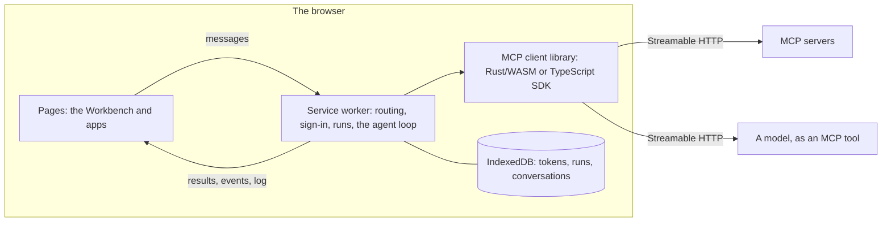

# MCP Browser Client

MCP Browser Client is a system for testing MCP (Model Context Protocol) client libraries in the browser and building applications on them. It concentrates on the agent loop: a model choosing tools and using them, with a client library doing the protocol work.

Everything runs in a web page and a service worker that every open tab shares. There's nothing to install or configure on anyone's machine: open the site, add servers, sign in, and every control is in the page.

- **MCP client libraries, swapped while it runs.** There are two: one in Rust compiled to WebAssembly, and one on the official TypeScript SDK. Both implement the same interface, pass the same browser test and run in the same benchmark. Runtime, in the top bar, switches between them. See [MCP client libraries](#mcp-client-libraries).
- **The agent loop.** Apps holds the apps built on the libraries. The first, Chat, sends your messages to a model that is an MCP tool, tells it which tools your servers have, and runs the tool calls it writes in its replies. See [The agent loop](#the-agent-loop).
- **Tool use by hand.** The [Workbench](#workbench) inspects a server, calls its tools, saves the calls that work and runs them again to see what changed. Every call, whether from you, an app or a model, is recorded.
- **Web delivery and controls.** It's a static site. Sign-in is OAuth in the browser, tokens stay in the browser, and saved requests, history and conversations live in IndexedDB. Servers, the client library, the log and the HTTP trace are all in the page.

It speaks MCP 2026-07-28 and falls back automatically for servers still on the older, `initialize`-based revisions.

## Try it

Open [patrick-glean.github.io/mcp-browswer-client](https://patrick-glean.github.io/mcp-browswer-client/). The Guide (top right, and open on your first visit) has one-click buttons for public MCP servers that need no account, such as Hugging Face and Microsoft Learn. Choose one, click a tool, fill in its fields and choose Run. The log at the bottom shows what happened.

Runtime, in the top bar, shows which MCP client library is running and switches it. The Workbench is where you work with servers: Pre-fill a tool's fields, use `{{variables}}`, save the calls that work and run them again to see what changed. Apps holds the Chat app, an agent loop over your servers' tools.

For servers that need an account, the client signs in with OAuth, as desktop MCP clients do. The Guide starts with Glean: enter your work email (or paste your Glean MCP server URL) and choose Add and sign in. See [Glean](#glean) for the one catch: Glean only answers pages from origins it allows.

## MCP client libraries

The MCP client is a library the service worker loads. Pages never speak MCP: they ask the worker to connect, list tools or call one, and the worker calls the library. Any library that implements [the interface](DEVELOPMENT.md#the-interface) can run. The rest of the app (the Workbench, apps, sign-in, run history, the log) works the same on each.

| Library | Source | Download (gzipped) |
| --- | --- | --- |
| Rust/WASM (`wasm`, the default) | `src/`, compiled with wasm-bindgen | 563 KB (200 KB), module and bindings |
| TypeScript SDK (`sdk`) | `sdk-client/`, an adapter over [`@modelcontextprotocol/client`](https://github.com/modelcontextprotocol/typescript-sdk) 2.3 | 340 KB (94 KB) |

**Switching.** Choose Runtime, then Library, or add `?client=sdk` (or `?client=wasm`) to the address. Every tab switches at once, and the worker remembers the choice when the browser restarts it. Connections don't carry over, so each server connects again on its next request. The log names the library that loaded ("Loaded the TypeScript SDK client (…)"), and its entries carry the library's name as their source.

**Comparing.** The browser smoke test runs on either library (`npm run test:browser` and `npm run test:browser:sdk`), and both pass every check. They send the same requests in the same order; [DEVELOPMENT.md](DEVELOPMENT.md#how-the-two-differ) lists the small differences. `npm run bench` measures tool-call throughput four ways: each library alone against an in-memory server, over HTTP against the mock server, a cold start, and calls through the whole app. `/bench/` in the app runs the same benchmark in your browser.

On an Apple M4 with Chrome 154, in October 2026:

| | Rust/WASM | TypeScript SDK |
| --- | --- | --- |
| Through the whole app, one call at a time | 189 calls/s | 185 calls/s |
| Through the whole app, six in flight | 322 calls/s | 322 calls/s |
| The library alone: a small JSON reply | 51 µs | 48 µs |
| The library alone: a small streamed (SSE) reply | 52 µs | 129 µs |
| The library alone: a 1 MB result | 9.6 ms | 4.6 ms |
| Cold start: load, connect, first call | about 15 ms | about 30 ms |

The library isn't what limits tool calls. Through the whole app both run at the same rate, and most of each call's 5 ms is the app's own work around it: the messages between page and worker, the run history and the log. On their own, the Rust library is faster with streamed replies and starts faster, and the SDK is faster with big results. Both are kept, because two independent implementations of one interface are what make these comparisons possible. [Adding a library](DEVELOPMENT.md#adding-a-library) puts a third one through the same tests.

## The agent loop

Apps, in the top bar, holds the apps built on the libraries. The first, Chat, is an agent loop over your servers' tools, run by the service worker:

- **The model is an MCP tool** on any server you've added. Choose it under Model, tick "Your message goes here" on the text field that should get what you type, and tick "The conversation goes here" on a list field to send the conversation.
- **Tool choice.** With a conversation field, the model gets the built-in instructions (how to ask for a tool call), every server you've added with its tools' names, descriptions and schemas, and the context you add under Instructions and context, followed by the conversation. Static tokens are left out of what the model sees. Without a conversation field, the model gets only your message.
- **Tool use.** A JSON-RPC request in a code block of the model's reply, `{"jsonrpc": "2.0", "method": "<tool name>", "params": {…}}`, is a tool call. The worker finds a server with that tool, calls it through the library and adds the result to the conversation, at most three such calls per conversation every 10 seconds. The model sees the results with your next message.
- **Everything is recorded.** The model's calls and the tool calls from its replies are runs like any other. The dock's Runs shows each one with its arguments and result, and any of them can be opened in the Workbench and run again.
- **Conversation** shows the conversation's ID, with New conversation to start over. Conversations are kept in this browser's IndexedDB.

The loop is in `public/sw.js` (`handleToolCall`, `modelArguments` and `runReplyToolCall`), and the built-in instructions are in `public/chat-instructions.js`. [DEVELOPMENT.md](DEVELOPMENT.md#the-agent-loop) has its messages and where it keeps what. Next are apps described by a manifest, holding the model, the tools it may use, pinned arguments, instructions and checks on the output, so other apps can be built the same way.

## Workbench

The Workbench is where you work with MCP servers by hand: try their tools, keep the calls that work, and run them again to see what changed. Saved requests are also what apps will be built from next.

Its layout, from left to right:

- **The rail**: your servers (with their status, tool count, or Sign in), saved requests grouped in collections, and the latest runs. Add a server with +: paste its URL, or enter your work email to find your company's Glean.
- **The server bar**, across the top: the selected server's status and protocol, sign-in, Connect, Refresh tools and Info.
- **Tools**: the selected server's tools, with a filter and annotation filters.
- **The request pane**: the tool's arguments, with Pre-fill, Save and Run, and tabs for Sends (the arguments as they'll go out) and Schema.
- **The response pane**: the outcome, how long it took and whether the result changed since the last run, with tabs for Result, Changes, JSON and Runs (every run of this request).
- **The dock**, along the bottom: Log, Trace (every HTTP request and response) and Runs (every call). Collapse it, or drag its top edge.

The top bar switches between the Workbench and Apps, picks the environment and opens Variables, and has Go to (⌘K or Ctrl+K) for any server, tool or saved request. ⌘↵ or Ctrl+Enter runs the request, ⌘S or Ctrl+S saves it, `/` jumps to the tool filter and Escape closes menus and side sheets.

- **Pre-fill.** One click fills a tool's fields from what you last sent to it, or else your newest saved request for it, or else its schema. The menu beside it picks a source:
  - what you last sent
  - any saved request for the tool
  - the schema: each field's `const`, `default` or first `examples` value. Required fields without one get the first enum choice, the minimum (or 1) for numbers, and false for booleans. A field named like a variable gets that variable.
  - nothing (clears the fields)
- **Environments and variables.** Choose an environment in the top bar and edit its variables under Variables.
  - Write `{{name}}` in any field, number fields included. The field shows what it becomes, such as `→ hi world · from Default`.
  - A field that is exactly one variable gets the variable's value converted to the field's type: a number, true or false, or JSON for objects and arrays. Text around variables stays text.
  - A call with an unknown variable doesn't go out, and says which variable.
  - Sends shows the arguments as they'll go out.
- **Saved requests.** Save keeps the tool, its arguments as written (variables and all) and a name, optionally in a collection.
  - The rail lists them by collection, each with how its last run went. Open one to fill the request pane, choose ▶ to run it, or rename and delete it from its menu.
  - A request opened from a saved request runs as that request (the request pane's path ends with its name), and Save updates it (or Save as new).
- **What changed.** Each result says whether it's the same as the last run of the same request or has changed; Changes has the line diff.
  - A saved request's runs compare with each other. Other calls compare with earlier calls of the same tool with the same arguments.
  - `_meta` is ignored, since servers put request IDs and timings there.
- **Run all** runs a collection's requests in the order they were saved. The response pane fills in a report as they run, then sums up how many were the same, changed or failed. Each row opens that run.
- **History**: the rail shows the latest runs, and the dock's Runs every tool call, wherever it came from: the Workbench, Run all, the Chat app's model, and tool calls found in its replies.
  - Open one to see its arguments and result, then run it again or save it.
  - Only the selected server narrows the dock's list.
- **Export and Import**, in the ⋯ menu beside Saved, move saved requests, collections and environments as one JSON file. History isn't exported.

Everything stays in this browser, in IndexedDB (`mcp_sandbox`, its name from when the Workbench was called the Sandbox), shared by its tabs.

- History keeps the newest 500 calls with their results, which include whatever the servers sent back. Results over 256 KB keep only their start. Clear history, in the dock's Runs, deletes it.
- Tokens never go into the Workbench's store: arguments are stored as written, and credentials travel separately. Variables are plain text, so keep secrets out of them.

### Inspecting a server

The Workbench doubles as an inspector, in the spirit of the MCP Inspector but without installing anything:

- **Connection**: the server bar shows the status, the protocol and era, and the server's name and version. Info opens a side sheet with the capabilities it declared, how you're authenticated, the server's instructions and its address.
- **Tools**: the count, a filter on name, title and description (`/` jumps to it), and filters for what the annotations say: Read-only, Writes (anything that doesn't say it only reads) and Reaches out (open world). Each row marks the tool `ro`, `writes`, `del` or `?` (no read-only hint, so assume it may write), plus `web` and `app` (MCP Apps UI). Servers with many tools are grouped by what their tools work on (`issue`, `pull request`, `search`). Annotations are hints from the server, not guarantees.
- **Tool details**: the request pane shows the tool's title and badges and the argument form; Schema has the input schema, output schema and raw definition.
- **Hidden tools**: tools the client won't call, listed after the others with the reason.
- **Download the server report**, in the server bar's ⋯ menu or under Info, saves the server's details and full tool list as JSON.
- **Resources and Prompts** have their tabs beside Tools, disabled until the client supports them.

## MCP Support

Both libraries work out which protocol era a server speaks the same way:

1. The client sends `server/discover` as a 2026-07-28 request. Every modern request carries `_meta` with the protocol version, client info and capabilities, plus the `MCP-Protocol-Version`, `Mcp-Method` and (for `tools/call`, `resources/read`, `prompts/get`) `Mcp-Name` headers.
2. If the server answers, it's modern. If it rejects the version with `-32022`, the client retries with one the server lists.
3. Any other `4xx`, or a JSON-RPC error that isn't one of the modern codes, means a legacy server. The client then runs the `initialize` handshake (offering 2025-11-25) and sends `Mcp-Session-Id` and the negotiated version from then on.
4. If the browser can't read any reply to `server/discover`, the client tries the `initialize` handshake anyway. A browser reports a CORS preflight that rejects the new headers exactly like an unreachable server, and the handshake needs fewer headers, so this covers 2025-era servers with strict CORS allowlists. If the handshake reaches a modern server, the error says which headers its CORS policy must allow.

The result is remembered per server URL. After the browser restarts the service worker, the first request reconnects automatically. Replies can be plain JSON or an SSE stream. Tool lists are paginated and cached for the server's `ttlMs`. Parameters a tool marks with `x-mcp-header` are also sent as `Mcp-Param-*` headers, and tools with invalid annotations are hidden.

Known constraints:

- **CORS**: the server must allow this site's origin and the headers above: `MCP-Protocol-Version`, `Mcp-Method`, `Mcp-Name`, any `Mcp-Param-*` its tools use, and `Authorization` for tokens. Legacy servers that use sessions must also list `Mcp-Session-Id` in `Access-Control-Expose-Headers`, or the browser can't read it. Sign-in also needs CORS on the metadata, registration and token endpoints.
- **Local servers**: from a public site such as GitHub Pages, Chrome 142+ asks the user before it lets the page reach `localhost` ("Apps on device").
- **Not yet supported**: `input_required` results (elicitation), `subscriptions/listen`, resources and prompts in the UI, and the deprecated 2024-11-05 HTTP+SSE transport.

### Sign-in (OAuth)

A server that answers HTTP 401 needs you to sign in: the server rail marks it "Sign in", and the bar above its tools offers Sign in. The client follows the MCP authorization spec (2026-07-28):

1. **Find the authorization server.** It reads the protected resource metadata (RFC 9728) from the 401's `WWW-Authenticate` header when the browser lets it, and otherwise from `/.well-known/oauth-protected-resource` under the server's path, then its root. The metadata must name this server as its resource. Then it reads the authorization server's metadata (RFC 8414, falling back to OpenID Connect discovery); the issuer must match exactly, and it must support PKCE with S256.
2. **Register.** It registers itself with dynamic client registration (RFC 7591), as a `native` app when the page is served from `localhost` or `127.0.0.1` and a `web` app otherwise, with `oauth-callback.html` next to the page as the redirect. Registrations are kept per authorization server and reused.
3. **Sign in.** A pop-up opens on the authorization page with PKCE, `state` and the `resource` parameter (RFC 8707). It asks for the scope from the server's challenge or metadata, plus `offline_access` when offered, so it gets a refresh token. The authorization server sends the pop-up back to `oauth-callback.html`, which hands the response to the service worker. The worker checks `state` and the `iss` parameter (RFC 9207), exchanges the code, and the page reconnects.

   Where pop-ups don't work (embedded browsers such as Cursor's, or a strict blocker), the server bar offers three other ways:

   - **Continue in this tab** goes to the sign-in page in the same tab. You come back to the client, connected.
   - **Copy link** copies the sign-in page's address, to open in another tab of the same browser. The tab you started in connects when you finish.
   - **Signing in from another browser?** is for browsers that can't complete the sign-in. Some identity providers refuse embedded browsers, for example. Open the copied link in another browser and sign in. That browser lands on a page that says it isn't where you started and shows its address; paste that address into the server bar where you started. Only the browser that started a sign-in holds its `state` and PKCE verifier, so the code is redeemed there.
4. **Stay signed in.** Requests carry the access token. A token that expires within a minute is refreshed first, and a token the server turns down is refreshed once and the request retried. When the refresh token stops working, the server bar asks you to sign in again.

Tokens live in this browser's IndexedDB (`mcp_auth`), are shared by every tab, and are only sent to the server they were issued for and its authorization server. Pages only learn whether you're signed in, never the tokens, and the HTTP trace redacts tokens, codes and verifiers. Sign out forgets the tokens; Shift-click it to also forget the client registration. A static bearer token, under Info, then "Use a static token instead of signing in", takes precedence over sign-in; it's stored in `localStorage` and goes only to its own server.

Not supported yet: client ID metadata documents (the spec's preferred alternative to dynamic registration), step-up authorization when a server asks for more scopes, and revoking tokens on sign-out.

## Architecture



1. **Pages** draw the UI, in as many tabs as you like. They send the worker messages and never speak MCP or see a token.
2. **The service worker** is shared by every tab. It loads the chosen library, routes each message to it, keeps sign-ins, runs and conversations in IndexedDB, and runs the Chat app's agent loop.
3. **The MCP client library** speaks MCP to servers over Streamable HTTP: era detection, sessions, streamed replies, header parameters, and sign-in's network steps. It stores nothing.
4. **A model is just another MCP tool**, so the loop works with any server that offers one.

[DEVELOPMENT.md](DEVELOPMENT.md) has the messages between pages and the worker, the library interface and how to add a library.

## Run it locally

Only needed to change it; the deployed site needs nothing installed. Prerequisites:

- Node.js 22+ and Google Chrome (to build the TypeScript SDK library and run the tests)
- Python 3.x (the mock MCP server uses only the standard library)
- Rust, for the Rust/WASM library: install via rustup, `curl --proto '=https' --tlsv1.2 -sSf https://sh.rustup.rs | sh`

1. Run the setup script once. It installs the dependencies and builds both libraries:

   ```bash
   ./setup.sh
   ```

2. Start the app on http://localhost:8080 (with HTTP caching off, so rebuilds show up on reload):

   ```bash
   npm start
   ```

3. In a second terminal, start the mock MCP server on http://127.0.0.1:8081:

   ```bash
   npm run start:mock-mcp
   ```

4. Open http://localhost:8080 and follow the Guide, or see [Testing](#testing) below.

## Development

### Available Scripts

- `npm start`: Start the web server on port 8080 with caching off
- `npm run start:glean`: The same on `http://127.0.0.1:8888`, an origin Glean allows (see [Glean](#glean))
- `npm run build`: Build both MCP client libraries: Rust/WASM (`npm run build:wasm`) and the TypeScript SDK one (`npm run build:sdk`)
- `npm run start:mock-mcp`: Start the mock MCP server on port 8081 (pass flags after `--`, e.g. `npm run start:mock-mcp -- --mode legacy`)
- `npm run start:reference-mcp`: Start the official-SDK reference server on port 8082 (needs the venv)
- `npm run test:rust`: Run the Rust library's unit tests
- `npm run test:browser`: Run the browser smoke test on the Rust/WASM library (add `-- --reference` to include the Python SDK server); `npm run test:browser:sdk` runs it on the TypeScript SDK library
- `npm run test:public`: The browser smoke test plus the public servers the Guide suggests (needs internet)
- `npm run bench`: Load-test tool calls on every library against the mock server and an in-memory one, plus a cold start and calls through the whole app (`-- --quick` for a fast pass)

### Changing a library

1. Edit the Rust library in `src/` (protocol in `src/mcp/`, sign-in in `src/oauth/`, exports in `src/lib.rs`), or the TypeScript SDK one in `sdk-client/`.
2. Rebuild it: `npm run build:wasm` or `npm run build:sdk`.
3. Reload the page. The log shows "Installing the service worker with the MCP client library builds …" and then "Loaded the … client" with the new build time.

Each library's build writes a small file with the output's hash (`public/build.js`, `public/build-sdk.js`). The worker imports both, so every rebuild is a worker update that the next reload installs. Commit the build outputs with the source: the site is what's committed in `public/`.

### Changing the web interface

Edit files in `public/` and reload. Style new UI with the `--theme-*` variables from `public/tokens.css` rather than raw colors, so light and dark mode both keep working. Dark mode is the `dark-theme` class on `<html>`; the top bar's toggle sets it and otherwise it follows the OS setting.

The Workbench is built from components (custom elements in `public/workbench/components/`) that don't know about each other. Each draws itself from two shared objects and talks only through them:

- `AppShell` (in `index.html`) owns the service worker, the server list, sign-in and tool calls, and announces changes as events: `servers`, `select`, `tools`, `auth`, `run` and `recorded`.
- The Workbench state (`workbench.js`) owns the selected tool, environments, saved requests, Run all and the frame (dock, side sheets), with events of its own.

The layout is CSS: each component sits in a named grid area, set by the `data-layout` block for `#workbench` in `workbench.css`. To try another arrangement, add a layout there and set `data-layout` on `#workbench`; the components don't change.

### Project Structure

```text
.
├── src/                    # The Rust/WASM library
│   ├── lib.rs             # Its exports: the library interface
│   ├── error.rs           # The error type every export rejects with
│   ├── http.rs            # fetch with timeouts, a redacted HTTP trace, form and JSON bodies
│   ├── logging.rs         # Structured log entries, sent to the worker's logger
│   ├── mcp/               # MCP: transport, SSE parser, headers, modern and legacy eras
│   ├── oauth/             # Sign-in: discovery, client registration, PKCE, token exchange and refresh
│   └── build_info.rs      # Generated build metadata
├── sdk-client/             # The TypeScript SDK library: the same interface on @modelcontextprotocol/client
│   ├── index.js           # Its exports
│   ├── mcp.js             # Connections, era detection and the CORS fallback, on the SDK's Client
│   ├── oauth.js           # Sign-in, on the SDK's auth()
│   ├── trace.js           # The HTTP trace, with redaction
│   └── build.mjs          # Bundles it with esbuild into public/sdk_client.js
├── public/                 # The site
│   ├── index.html         # The page: top bar, layout, Apps (Chat), the Guide, and AppShell,
│   │                      #   which owns the worker, servers, sign-in and calls
│   ├── sw.js              # The service worker: messages, sign-in, runs, the agent loop
│   ├── mcp-clients.js     # The MCP client libraries and how to load each
│   ├── client-runtime.js  # Keeps the chosen library loaded in the worker and forwards its logs
│   ├── mcp_browser_client_bg.wasm, mcp_browser_client.js  # Built: the Rust/WASM library
│   ├── sdk_client.js      # Built: the TypeScript SDK library
│   ├── build.js, build-sdk.js  # Built: each library's hash, so a rebuild updates the worker
│   ├── logger.js          # The worker's structured logger
│   ├── authStore.js       # IndexedDB storage for sign-ins: registered clients, tokens, sign-ins in progress
│   ├── chatStorage.js     # IndexedDB storage for conversations
│   ├── workbench/         # The Workbench: its components, state and storage (ES modules)
│   │   ├── index.js       # Starts it: loads the state, defines the components, wires shortcuts
│   │   ├── workbench.js   # Shared state and actions: selection, environments, saved requests, runs
│   │   ├── workbench.css  # The frame and the layout (grid areas), and each component's styles
│   │   ├── components/    # One custom element per part: rail, server bar, tools, request,
│   │   │                  #   response, dock, side sheet, Go to palette
│   │   ├── store.js       # IndexedDB storage (mcp_sandbox), shared by the page and the worker
│   │   ├── runs.js        # What counts as the same request and a changed result
│   │   ├── template.js    # {{variable}} resolution with type conversion
│   │   ├── prefill.js     # Field values from a tool's schema
│   │   ├── diff.js        # The line diff behind Changes
│   │   └── util.js        # Small shared helpers (escaping, badges, time)
│   ├── bench/             # The tool-call benchmark, with its own service worker and an in-memory server
│   ├── oauth-callback.html # Where authorization servers send the browser back after sign-in
│   ├── styles.css         # UI styles (Glean design language)
│   ├── tokens.css         # Design tokens: light and dark theme colors, type, radii, shadows
│   ├── fonts/             # Inter and DM Sans (OFL)
│   └── icons/             # Feather icons, rendered as CSS masks (MIT)
├── tests/
│   ├── browser-smoke.mjs  # Drives the real UI in headless Chrome against test servers, on either library
│   ├── bench.mjs          # Runs the benchmark headlessly against the mock server
│   └── reference_server.py # A server on the official MCP Python SDK, for interop checks
├── test_mcp_server.py     # Mock MCP server (modern, legacy or dual-era; JSON or SSE; tokens; OAuth; strict CORS)
├── DEVELOPMENT.md         # The library interface, the worker's messages, the agent loop, logging
├── Cargo.toml             # The Rust library's configuration
├── package.json           # Node.js configuration and scripts
├── requirements.txt       # Python dependencies (the official MCP SDK, for the reference server)
├── wasm-build.sh          # Builds the Rust/WASM library
├── generate-build-info.sh # Build metadata for the Rust library
├── deploy-gh-pages.sh     # Publishes public/ to the gh-pages branch
└── setup.sh               # Project setup script
```

## Testing

### A five-minute check

With `npm start` and `npm run start:mock-mcp` running, open http://localhost:8080:

1. **Connect.** In the Guide, choose "Add and connect to 127.0.0.1:8081" (or choose + beside Servers and paste `http://127.0.0.1:8081`). The server bar should say `Connected · MCP 2026-07-28 (modern)`, and Tools should list `echo`, `echo_region`, `count` and `ticket`. The mock also offers `broken_header`, which clients must hide; it's listed after them with the reason.
2. **Run a tool.** Choose `echo`, type `hi` into `text` and choose Run. The result reads `Echo: hi`.
3. **Header parameters.** Run `echo_region` with region `Zürich`. The result reads `Echo from Zürich: …`; the mock checks that the `Mcp-Param-Region` header carried the same value, base64-encoded because it isn't ASCII.
4. **The log.** In the dock you should see lines like `Connected to Mock MCP Server 2.0.0 in 9 ms: MCP 2026-07-28 (modern)`, `Listed 4 tools in 5 ms`, `Hiding tool broken_header: …` and `echo returned in 3 ms`. Trace has each HTTP request (`→ tools/call echo (id 5)`) and reply (`← HTTP 200 for tools/call echo (id 5) in 3 ms`).
5. **Chat through a tool.** Open Apps. Under Model, choose the mock and `echo`, tick "Your message goes here" on `text`, and send `hello`. The reply `Echo: hello` joins the conversation.
6. **Save and run again.** Back in the Workbench, choose `ticket`, then Pre-fill (the schema gives `prefix` its default, `T-`) and Save. In the rail, run it twice with ▶. The second result says Changed since the last run, and Changes has the line that differs, because `ticket` returns the next number every time. A saved `echo` says Same as the last run.
7. **Variables.** Under Variables, add `greeting` = `hi`. Run `echo` with text `{{greeting}} world`; the field shows `→ hi world`, Sends shows `"hi world"`, and so does the result. The dock's Runs lists every call so far, including the chat's.
8. **The legacy fallback.** Stop the mock, start it with `npm run start:mock-mcp -- --mode legacy`, and choose Connect. The protocol becomes `2025-11-25 (legacy)`, and the log explains why: `server/discover got HTTP 400, …, so this looks like a 2025-era server; falling back to the initialize handshake`.
9. **The other library.** Open Runtime and choose TypeScript SDK under Library, then run the saved `echo` again. The log shows "Loaded the TypeScript SDK client", the server connects again, and the result is Same as the last run.

### More server behaviors

`test_mcp_server.py` needs only Python's standard library. Its flags simulate the situations a browser client has to handle:

| Flag | What the mock does |
| --- | --- |
| `--mode modern` | Speaks only 2026-07-28 |
| `--mode legacy` | Acts as a 2025-era server: `initialize` handshake and `Mcp-Session-Id` |
| `--sse` | Streams replies as SSE instead of JSON |
| `--token s3cret` | Requires `Authorization: Bearer s3cret`. Connect fails asking you to sign in or set a static token; under Info, open "Use a static token instead of signing in", paste it and choose Connect |
| `--oauth` | Requires an OAuth sign-in: serves protected resource and authorization server metadata, accepts client registrations, approves sign-ins at once (no login page), and issues refresh tokens that rotate |
| `--hide-www-authenticate` | Keeps the 401's `WWW-Authenticate` header from the page, as Glean does, so the client has to find the metadata at its well-known address |
| `--token-ttl 5` | How long access tokens last, in seconds (default 3600) |
| `--omit-expires-in` | Leaves `expires_in` out of token responses, so the client learns of expiry from a 401 |
| `--oauth-wrong-iss` | Names the wrong issuer in sign-in responses, which the client must reject |
| `--allow-headers "Content-Type, Mcp-Session-Id, MCP-Protocol-Version"` | Uses a CORS policy written before 2026-07-28. With `--mode legacy` the client still connects; with `--mode modern` it explains which headers to allow |
| `--allow-origin https://example.github.io` | Accepts requests from another page origin (repeatable) |
| `--keep-alive` | Speaks HTTP/1.1 and keeps connections open between requests, as most servers do, instead of a connection per request (the benchmark uses it) |
| `--verbose` | Prints every request's headers and body |

`--port` and `--host` change where it listens. Every request is printed with its result, such as `POST tools/call (modern) -> 200`.

### Real servers

These public servers need no account, allow browsers through CORS, and are in the Guide:

| Server | URL | Speaks | Try |
| --- | --- | --- | --- |
| Hugging Face | `https://huggingface.co/mcp` | 2026-07-28 | `hub_repo_search` with query `whisper` |
| Context7 | `https://mcp.context7.com/mcp` | 2026-07-28 | `resolve-library-id` with libraryName `react` and query `hooks` |
| Microsoft Learn | `https://learn.microsoft.com/api/mcp` | 2025-06-18, with a session and SSE replies | `microsoft_docs_search` with query `service worker` |
| DeepWiki | `https://mcp.deepwiki.com/mcp` | 2025-11-25, without a session | `read_wiki_structure` with repoName `modelcontextprotocol/modelcontextprotocol` |

They're third-party services, so their behavior can change; `npm run test:public` checks that each one still connects and answers its sample call. It also connects to GitMCP (`https://gitmcp.io/docs`), whose reply to `server/discover` lacks CORS headers, so it's only reachable through the fallback described in [MCP Support](#mcp-support).

`tests/reference_server.py` runs a server on the official MCP Python SDK (`npm run setup:python` installs it, then `npm run start:reference-mcp`); add `http://127.0.0.1:8082/mcp`.

### Glean

Glean's MCP server signs you in with your work account through dynamic client registration, which the client handles. Its URL looks like `https://your-company-be.glean.com/mcp/default`. You don't need to look it up: enter your work email in the Guide's Glean field, and the page asks `app.glean.com/config/search` which deployment your email belongs to, the way Glean's own sign-in page does. It then uses that deployment's default MCP server. Only the email's domain is logged. That endpoint isn't a documented API, so you can also paste the URL yourself, from Glean's Your settings, then Third party apps and MCP, on the "Connect to your AI apps with Glean MCP" card. Use the pasted URL if your company uses a server other than `default`.

Glean only sends CORS headers to page origins on its allowlist, so from an origin that isn't on it every request fails as "Couldn't reach". Glean's own deployment allows `http://127.0.0.1:8888` (and not `localhost:8888`), so:

```bash
npm run start:glean   # serves public/ on http://127.0.0.1:8888 (after ./setup.sh or npm install)
npx --yes http-server public -a 127.0.0.1 -p 8888 -c-1   # the same, without installing the project's dependencies
```

Avoid `python3 -m http.server` for the app: it resets connections when the page and the worker load their modules at the same time, which can stop the service worker from starting.

Open http://127.0.0.1:8888, enter your work email (or the URL) in the Guide's Glean field and choose Add and sign in, or enter it under + beside Servers. `app.glean.com` answers the same origins as Glean's MCP servers, so the email lookup works from here too. Sign in with your SSO in the pop-up; the server then connects and lists its tools. Try its search tool (`enterprise_search` on the default server) with query `onboarding`. Glean shows the client under Third party apps and MCP as "MCP Browser Client", where you can revoke it.

What to expect in the log: `server/discover` is blocked (Glean's CORS policy doesn't allow the 2026-07-28 headers), so the client connects with the 2025 handshake; the 401's challenge isn't readable, so the client finds `/.well-known/oauth-protected-resource/mcp/default`, registers, and signs in with `https://your-company-be.glean.com/oauth` for `mcp offline_access`.

### From the deployed site

The GitHub Pages copy can reach a mock on your machine too. Start it with the site's origin allowed, as the Guide's command does:

```bash
python3 test_mcp_server.py --allow-origin https://patrick-glean.github.io
```

When you connect to `http://127.0.0.1:8081`, Chrome asks whether the site may access apps on your device. Allow it.

### Automated tests

```bash
npm run test:rust                    # the Rust library: SSE parsing, headers, era detection, OAuth discovery and checks, redaction
npm run test:browser                 # the real UI in headless Chrome against every mock variant, on the Rust/WASM library
npm run test:browser:sdk             # the same on the TypeScript SDK library (--client= picks any library in mcp-clients.js)
npm run test:browser -- --reference  # plus the official Python SDK server
npm run test:public                  # plus the public servers above (needs internet)
npm run bench                        # tool-call throughput of every library (-- --quick for a fast pass)
```

The browser test starts its own servers on ports 18080-18092 and drives the UI the way a person would. It covers modern, legacy, SSE, dual-era, strict-CORS and token-protected servers; sign-in through the pop-up and without one (in this tab, from another tab, and from another browser by pasting the address back), both kinds of refresh, sign-out, and rejected sign-in responses (wrong issuer, unknown state); finding Glean from an email, with `app.glean.com` answered by the test; the Workbench's layout and inspector views (badges, annotation filters, tool groups, hidden tools, Info, the report download); the Workbench itself (each Pre-fill source, variables in text and number fields with their resolved values, saved requests and collections, running again and Run all with what changed, the Runs tab, history in the rail and the dock including the chat's calls and after a reload, Go to and the keyboard shortcuts, the dock, export and import, and no tokens in its store); the Chat app, including that the model gets the server list without tokens and that conversations saved before its rename carry over; switching the MCP client library while the app runs; a worker restart, a second tab, the log pop-out, the Guide; and what the log records (timings, fallback reasons, no tokens anywhere, no HTML). It exits non-zero if a check fails, printing the client's own log and saving all of it as JSON.

The benchmark picks free ports, starts the mock with `--keep-alive`, and prints its results as tables, saving every round as JSON.

## Logs

The dock's Log collects entries from three kinds of source, shown in the third column:

- **page**: this tab (service worker registration, uncaught errors)
- **worker**: the service worker: each connect, tool listing and tool call with how long it took, failures with their error kind and status, and which library it loaded
- **wasm** or **sdk**: the MCP client library itself: why it chose a protocol (fallbacks, version retries, reconnects), tools it hid, and log messages the server sent

The level menu decides what's shown: Errors, Warnings and errors, Info (the default), or Everything, which adds the HTTP trace. Each request shows its MCP headers and body, and each reply its status, timing and body; bodies over 4 KB are cut short. Entries are kept even while hidden, so after a failure you can switch to Everything and see what led to it. Filter by text or server URL, and open Details for the structured data behind an entry. The dock's Trace tab shows only the HTTP trace.

- **Copy** copies the entries shown, one per line.
- **Download** saves every entry as JSON Lines, headed by the library's build and the browser, for bug reports.
- **Pop out** (the icon near Collapse) opens the log in its own window, with the history so far.
- **Errors** logged while the Log is hidden show as a count on its tab.

The `Authorization` header never appears in logs, nor do access and refresh tokens, authorization codes, PKCE verifiers or client secrets in sign-in requests and replies. Session IDs are shortened. Each tab keeps its last 1,000 entries.

The worker also prints every entry to its own console: open `chrome://inspect/#service-workers` (or DevTools → Application → Service workers) and choose Inspect. Debug entries show there at DevTools' Verbose level.

## Troubleshooting

- **"Couldn't reach …"**: the server isn't running, or it doesn't allow this site through CORS. A server on `localhost` reached from a public site also needs Chrome's local network permission.
- **"… CORS policy must allow the MCP-Protocol-Version, Mcp-Method and Mcp-Name headers"**: the server speaks 2026-07-28 but its CORS allowlist predates it. Add those headers (and any `Mcp-Param-*` its tools use) to `Access-Control-Allow-Headers`.
- **HTTP 404 or 405**: the URL isn't the MCP endpoint, which often ends in `/mcp`.
- **HTTP 401**: choose Sign in in the server bar, or, for a server that uses a fixed token, set it under Info, "Use a static token instead of signing in", and choose Connect.
- **Sign-in doesn't open**: the browser blocked the pop-up, or has none. Choose Continue in this tab or Copy link in the server bar (see [Sign-in](#sign-in-oauth)), or allow pop-ups for the page.
- **"This browser or app may not be secure" (Google) in an embedded browser**: copy the link, sign in from a regular browser, and paste the address it lands on back under "Signing in from another browser?".
- **Sign-in fails before the pop-up shows a login page**: the log names the step. Usually the server's metadata or registration endpoint doesn't allow this origin through CORS, or the authorization server doesn't support dynamic client registration.
- **Glean: "Couldn't reach …" or "Couldn't ask app.glean.com …"**: this page's origin isn't on Glean's CORS allowlist. Use `npm run start:glean` and http://127.0.0.1:8888 (see [Glean](#glean)).
- **Glean: "Glean doesn't know a deployment for …"**: the email's domain isn't one Glean recognizes (it answered with its central deployment). Check the address, or paste the server URL.
- **A tool call fails with a validation error**: optional fields left empty aren't sent, but required ones are; check the fields marked `*`.
- **Old behavior after a rebuild**: reload the page and check that the log shows "Loaded the … client" with the new build time. If it doesn't, the new worker may be waiting for the app's other tabs to close: Chrome sometimes keeps it waiting even though it asks to take over at once. Close the other tabs, or choose skipWaiting (or Unregister) in DevTools → Application → Service workers, then reload.
- **"Couldn't load the … client"**: that library's build output is missing. Run `npm run build`, then reload the MCP client from Runtime, or choose the other library.
- **Stuck on "Connecting…" or "Running …"**: the page gives up after 50 seconds (connect) or 130 seconds (tool call) with an explanation. Trace, in the dock, shows the last request that went out.

## License

MIT License
